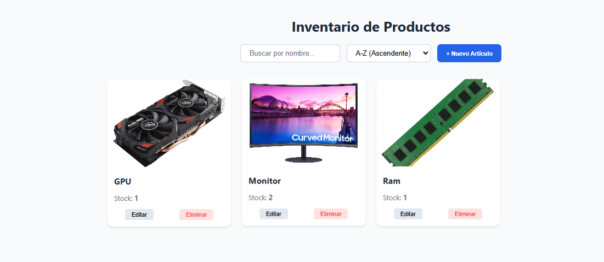
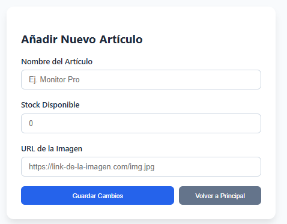

#  AppInventarioPADRI - Sistema de Gestión de Inventario

Aplicación web Full Stack para la gestión de stock de productos. Permite crear, leer, actualizar y eliminar artículos (CRUD completo) conectándose a una base de datos en la nube (MongoDB Atlas).

## 👥 Autores
* **Pablo** - Backend & Database
* **Adri** - Frontend & UI

---

##  Guía de Instalación y Ejecución 

Sigue estos pasos para probar la aplicación en tu entorno local:

### 1. Clonar o descargar el proyecto
Descarga el código fuente y ábrelo en Visual Studio Code o el IDE que utilices.

### 2. Configurar el Backend (Servidor)
El servidor necesita instalar sus dependencias para funcionar.
1.  Abre una terminal.
2.  Entra en la carpeta del backend:
    ```bash
    cd backend
    ```
3.  Instala las librerías necesarias en este caso (Express, Mongoose, Cors):
    ```bash
    npm install
    ```
4.  Arranca el servidor (obviamente hay que situarse dentro de la carpeta backend)
    ```bash
    node server.js
    ```
    *Deberías ver el mensaje: "¡Conexión exitosa a MongoDB Atlas!" y "Servidor corriendo en puerto 3000".*

> **Nota:** La base de datos cuenta con una función de "Semilla". Si es la primera vez que se ejecuta, **insertará automáticamente 30 artículos de prueba**.

### 3. Abrir el Frontend (Cliente)
1.  Sin cerrar la terminal del backend, ve a la carpeta `frontend`.
2.  Abre el archivo `index.html` en tu navegador (Chrome, Edge, Firefox, etc.).

---

##  Tecnologías Utilizadas

* **Backend:** Node.js, Express.
* **Base de Datos:** MongoDB Atlas (Nube), Mongoose (ODM).
* **Frontend:** HTML5, CSS3, JavaScript (Vanilla).
* **Arquitectura:** API REST.

##  Funcionalidades Principales

1.  **Vista Principal:**
    * Listado automático de productos con imagen, nombre y stock.
    * **Buscador** en tiempo real (filtra por nombre).
    * **Ordenación** alfabética (A-Z y Z-A).
2.  **Gestión de Artículos:**
    * **Crear:** Formulario para añadir nuevos productos.
    * **Editar:** Reutilización del formulario para modificar datos existentes.
    * **Borrar:** Eliminación con confirmación de seguridad.
3.  **Persistencia:**
    * Todos los cambios se guardan en tiempo real en MongoDB Atlas.
  
## 📸 Capturas de Pantalla

Aquí puedes ver cómo luce la aplicación:

| Vista Principal | Formulario de Edición |
|:---:|:---:|
|  |  | 
